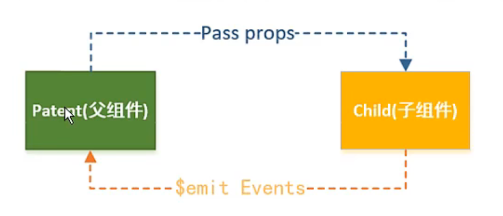
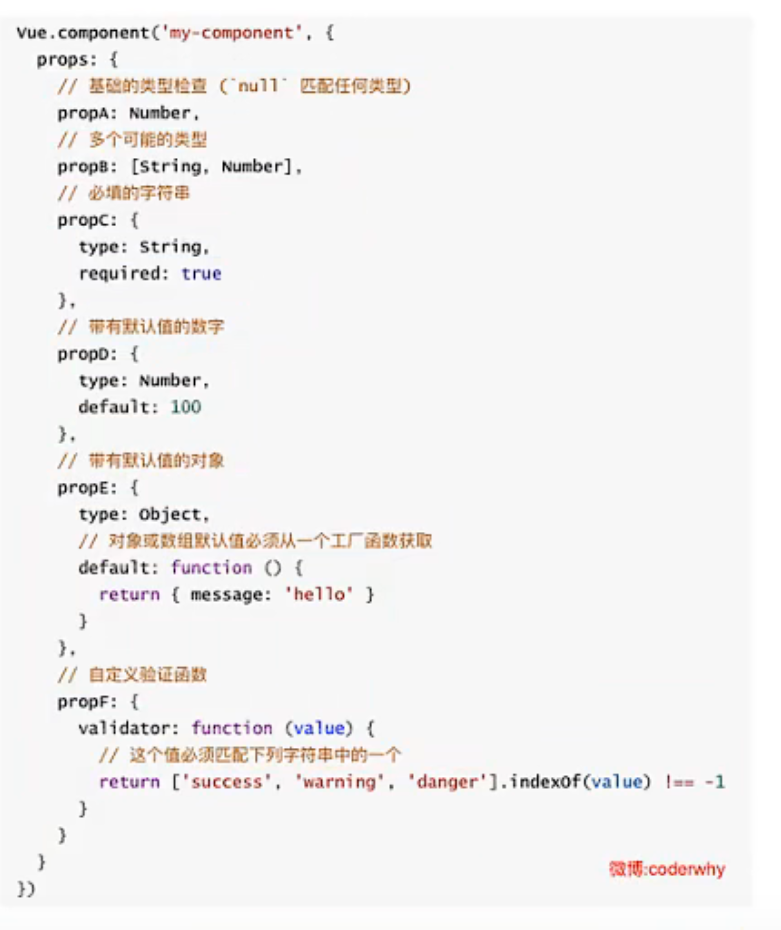

# 组件

### 组件的使用分成三个步骤
* 创建组件构造器
    * 调用Vue.extend()创建
        * 通常在创建组件构造器时，传入template代表我们自定义组件的模板
        * 该模板就是在使用到组件的地方，要显示的HTML代码
* 注册组件
    * 调用Vue.component()方法
    * 需要传递两个参数，1、注册组件的标签名 2、组件构造器
* 使用组件
    * 在Vue实例的作用范围内使用组件
    * 组件必须挂载在某个Vue实例下，否则他不会生效

### 父子组件
* 错误用法：
  * 因为当子组件注册到父组件的components时，Vue会编译好父组件的模块
  * 该模板的内容已经.决定了父组件将要渲染的HTML(相当于负组件中已经有了子组件中的内容了)
  * <child-cpn></child-cpn>是只能在负组件中被识别的
  * 类似这种用法，<child-cpn></child-cpn>是会被浏览器忽略的

### 子级向父级传递
* props用于父组件向子组件传递数据，还有一种比较常见的是子组件传递数据或事件到负组件中
* 使用自定义事件
  * 当子组件需要向父组件传递数据时，就需要用到自定义事件了
  * v-on不仅仅可以监听DOM事件，也可以用于组件间的自定义事件
* 自定义事件的流程
  * 在子组件中，通过$emit()来触发事件
  * 在负组件中，用v-on来监听子组件事件

# 回顾
### 一。计算属性
#### 1.1.计算属性的本质
* fullname:{set(),get()}
#### 1.2.计算属性和methods对比
* 计算属性在多次使用时，只会调用一次
* 他是有缓存的
### 二。事件监听
#### 2.1.事件监听基本使用
#### 2.2.参数问题
* btnClick
* btnClick(event)
* btnClick(abc,event) -> $event
#### 2.3.修饰符
* stop
* prevent
* .enter
* .once
* .native
### 三。条件判断
#### 3.1.v-if/v-else-if/v-else

#### 3.2.登录小案例
#### 3.3.v-show
* v-if和v-show的区别
### 四。遍历循环
#### 4.1.遍历数组
#### 4.2.遍历对象
* value
* value，key
* value，key，index
#### 4.3.数组哪些方法是响应式的
#### 4.4.作业完成
### 五。书籍案例
### 六。v-model的使用
#### 6.1.v-model的基本使用
* v-model=>v-bind:value v-on:input
#### 6.2.v-model和radio/checkbox/select
#### 6.3.修饰符
* lazy
* number
* trim
### 七。组件化开发
#### 7.1.认识组件化
#### 7.2.组件的基本使用
#### 7.3.全局组件和局部组件
#### 7.4.父组件和子组件
#### 7.5.注册的语法糖
#### 7.6.模板的分类写法
* script
* template
#### 7.7.数据的存放
* 子组件不能直接访问父组件
* 子组件中有自己的data，而且必须是一个函数
* 为什么必须是一个函数
#### 7.8.父子组件的通信
* 父传子：props
* 子传父：$emit
#### 7.9.项目
* npm install
* npm run serve
